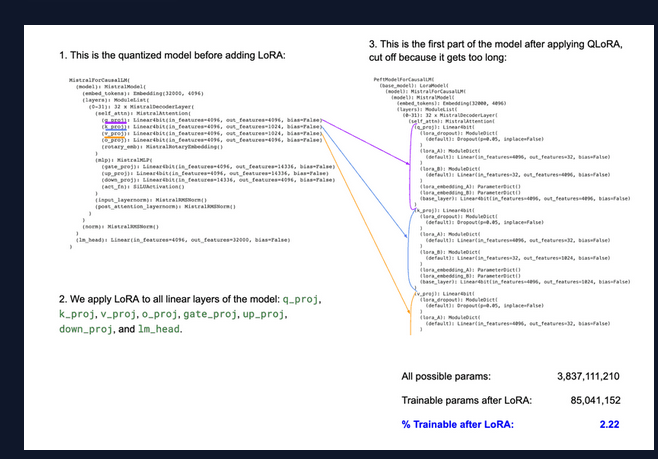

## Introduction

*Fine-Tuning Mistral 7B to Enable Quality Embedding and Text Generation for Amharic Language*

Given Telegram’s growing prominence as a messaging platform, AiQEM (an African startup focused on AI and Blockchain business solutions) needs to adjust its advertising strategy to better fit this ever-changing ecosystem.

This project intends to improve the effectiveness of their promotional efforts by integrating powerful AI capabilities for Amharic text manipulation, in particular creating an Amharic RAG pipeline that will help generate Amharic based creative text Ad contents given campaign information such as brief (brand and product information) and the content history of a telegram channel.

This project makes sure that their advertisements are both catchy and relevant to the Telegram community. To achieve this, the technology is required to have quality Amharic text embedding and text generation capability.

## Overview

As seen in the diagram above, a suitable opensource LLM model — in this case Mistral 7B - is used as a base model to train the LLM model on a dataset that will be utilized to finetune it further to deliver the business needs. This will result in a better capability to generate Amharic texts and Ads in general.

Finally, the business need comes to life when an efficient RAG system is implemented to help generate ideal Ad contents in Amharic given a specific brand information and campaign. The dataset that will be used for both Unsupervised and Supervised trainings is exported from Telegram, and which contains messages in JSON format representing 25 telegram public channels. The structure of the JSON object provides information about the sender, timestamps, message types, and any associated multimedia content.

The end product will be displayed through a Front-end where interested companies can sign in to generate brand and campaign specific Amharic ads for their channels using the Generative AI.

## Technical Overview
### Data Preprocessing

A total of 46,000 rows of raw telegram messages was cleaned and preprocessed for this task. Each data was labeled into categories as Ad and Non Ad so our LLM can be accurate in generating its content.

### Tokenizer 

Tokenization: is the breaking down the input text into individual units (tokens) like words or sub-words. A token is the smallest unit of language that a model can understand.

After having the data preprocessed and ready, we should Tokenize the dataset so our model understands what’s coming its way. For a Tokenizer the Garri Logistics tokenizer was used. (available on Huggingface).

But also we tried sentencepiece for the sake of experiment.

### Fine-Tuning 

In the Fine-tuning the model, there will be two steps

    - Unsupervised Training — We will train the model in a way that we want to improve its Amharic, we just provide clean data so it can learn its Amharic and give simple Amharic as an output.
    - Supervised Training — We will train the model in a way that we want to improve it’s Ad generation, we just provide a clean and Labeled data(Filtered with Ads only), so the output will be generating any Ads in Amharic.( category : Summarizing or Ad Generation )

Fine-tuning usually involves updating the entire set of parameters in the model, which can be computationally expensive and time-consuming for large language models. LoRA makes this process more efficient by creating and updating low-rank approximations of the original weight matrices (called update matrices) which are formed using low-rank decomposition on the original weight matrix. Only these matrices are updated during fine-tuning — the original model weights remain the same — and thus LoRA’s total number of trainable parameters is equal to the size of the low-rank update matrices. Since the low-rank matrices are being updated instead of all of the larger matrices with far more parameters, we can do this on a smaller, cheaper GPU.

### Quantization + LoRA = QLoRA

In this method, the original model’s parameters are first quantized to lower-bit values based on a user-defined quantization configuration. This makes the model more compact. Subsequently, LoRA is applied to the model’s layers to further optimize for the specific task. This combination in QLoRA allows for fine-tuning on significantly less computational power, which essentially democratizes the ability to fine-tune models.

### RAG

In the RAG system, we will make sure the trained model will generate a Specific Ad base on Product/Brand information and Current Campaigns as a context. The specific information and campaigns will be provided by 10Academy Team, so we are able to generate Amharic ads that are specific to some context in the end as a final output.Model will help us generate
Amharic —Ads in Amharic — Specific Ads in Amharic based on some Campaign and Product/brand info.

### Workflow

Loading the data -> Importing the Model -> Tokenize the data -> Finetune using QloRA -> Train the model

### Results

The fine-tuning was successful and the end product was more or less a good attempt. The model training might have been a little too Over-fitting.

Over-fitting is when the validation loss goes up (bad) while the training loss goes down significantly, meaning the model is learning the training set really well, but is unable to generalize to new data points. In most cases, this is not desired, but since this is the very first attempt and the first time fine-tuning a model with a moderate amount of over-fitting, it is considered as success.

### Conclusions 

The project was very enticing as well as very difficult as it was a very new concept for me, but after several reading and experiments, I was able to work on the project better and have a better understanding about LLMs and how they work as well as Fine-tuning and it perks. In addition, I had to spend a whole week with the messed up data on cleaning it and labeling it for further processing.

It was a group work and as a lead for the team, I have gained invaluable experience and work ethics, as well as copious knowledge on how to effectively lead a team into a project delivery.

Given more time and resource, I believe it something achievable to do and in more precision and accuracy to deliver a very good product in the end. With more considerations given on the model and it’s tokenizer as well as enhancing the RAG, can generate a good Specific Ad in Amharic for us