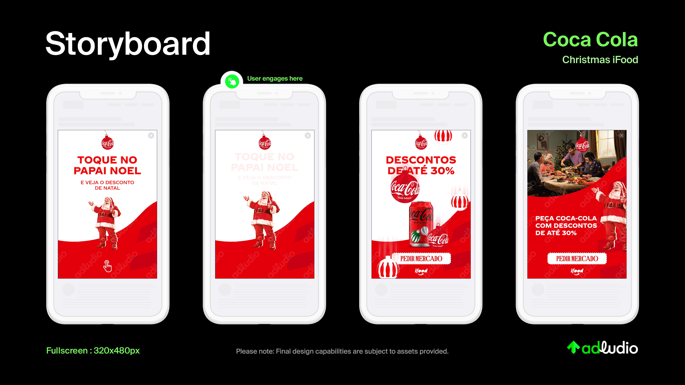
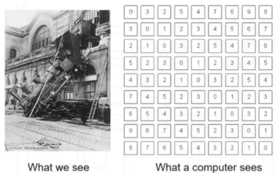
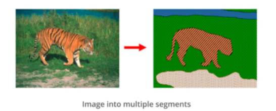
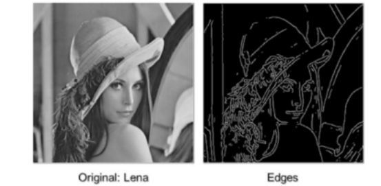
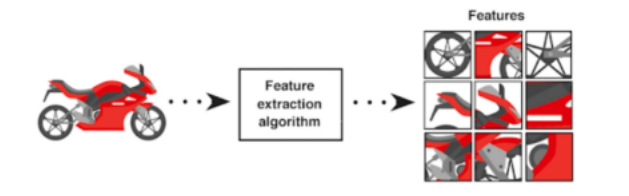
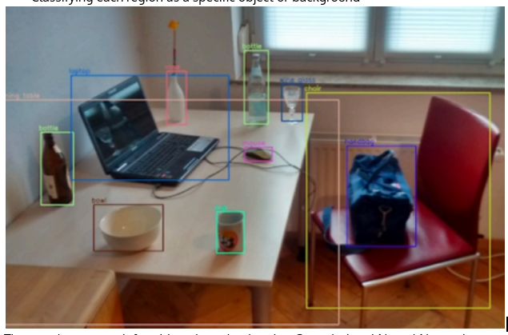
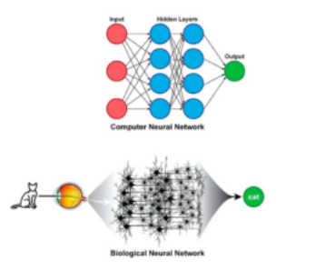
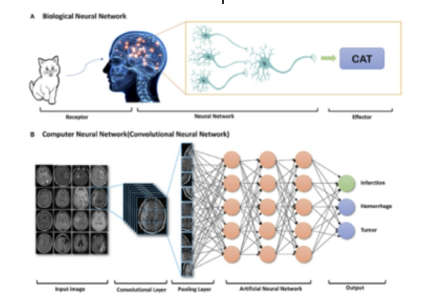

Adludio, a mobile ad company, had given a task with a machine learning solution that bridges the gap between textual concepts and visual storytelling. And so, this system automates the creation of storyboards from textual descriptions of advertisement concepts and assets. By automating this process, it will significantly speed up ad campaign creation, allowing clients to launch campaigns faster and with fewer resources. This project leverages advancements in machine learning, natural language processing, and computer vision to improve efficiency and creativity in digital advertising.

How it went about:

<pre>
Computer Vision 
CV enables computers and machines to see the visual world, just like the way humans see and understand their environment. It is a type of AI that allows computers to derive meaningful information from digital images, videos and other visual inputs to interpret 
and analyze the visual world and take actions or make recommendations based on that information 
While AI enables computers to think, Computer Vision enables computers to see, observe and understand. So with this, we are able to write computer programs that can interpret images and videos. 

**Computer Vision Techniques** 

Cv is a rapidly evolving field with numerous applications in various domains. It involves techniques such as Image processing, Filtering, Enhancement, Edge Detection, Feature Extraction and Object Detection. 
By leveraging these techniques, computers can gain a deeper understanding of visual information and perform tasks that were once exclusive to humans.

Fundamentals in Computer Vision 

Image Segmentation 
It is the process of partitioning an image into multiple segments to simplify the representation of an image into meaning features. It plays a crucial role in object recognition, image editing and computer vision tasks. One popular technique is the watershed algorithm. This algorithm is a region-based segmentation technique that treats the image as a topographic map which is widely used for segmenting objects with distinct boundaries. 

Edge Detection 

It is the process of identifying and locating sharp discontinuities in an image. It is an essential step in many computer vision tasks such as object detection and image recognition.

The Canny Edge detection algorithm is widely used for this technique. It is a multi-stage process that involves noise reduction, gradient calculation, non-maximum suppression and hysteresis thresholding. It aims to detect edges with the maximum possible accuracy while minimizing false positives. 

Feature Extraction 
This is the process of extracting meaningful information or features from an image. These features can be used for various purposes such as image classification, object recognition and image retrieval. One popular algorithm is the Scale-invariant feature transform (SIFT).

The SIFT algorithm detects and describes local features in an image that are invariant to scale, rotation and affine transformations. It works by identifying key points and extracting their descriptors based on the images gradient information. They are widely used in image matching and object recognition tasks. 

Object Detection 
It is the task of identifying and localizing objects in an image or video. It has two main steps. 
- Generating a set of candidate object regions 
- Classifying each region as a specific object or background

The popular approach for object detection is using Convolutional Neural Networks (CNNs) combined with techniques like Region Proposal Networks(RPNs). 

Let us dive into a little deeper…. 

Deep Learning for CV 
It is a subfield of Machine learning that focuses on training artificial neural networks with multiple layers to learn and make predictions from complex data. It has revolutionized the field of CV by achieving state-of-the-art results in various tasks such as Image classification, object detection and image segmentation.

 
  

CNN 
Convolutional Neural Networks are a type of deep neural network specifically designed for processing Gridlight data such as images. They consist of multiple layers including convolutional layers, pooling layers, and fully connected layers. CNNs are highly effective in capturing spatial and hierarchical patterns and images making them ideal for computer vision tasks. 
CNN Architecture 
1) Convolutional layers 
- Apply filters to the input image extracting features at different spatial scales. 2) Pooling layers 
- Reduce the spatial dimensions of the features 
3) Fully connected layers 
- Perform classification or regression based on the extracted features.
Train a CNN 
To train a CNN for our desired purpose, we need a large label dataset, and so the network learns to recognize patterns and features in the training data through a process called Backpropagation where the weights of the network are adjusted to minimize the difference between predicted and actual outputs. The training process involves Backpropagation, Forward propagation and optimization algorithms such as Stochastic Gradient Descent. 
Image Generations 
AI image generators create new images based on descriptions using trained neural networks. They are trained on massive datasets of images, learning their characteristics and styles. This allows them to generate unique visuals that resemble the training data. Different techniques exist, like neural style transfer and Generative Adversarial Networks (GANs). Overall, AI image generators use cutting-edge technology to unleash creative possibilities. 
DALL-E is an AI image-generative technology developed by OpenAI. 
Diffusion Models 
Diffusion models are a type of generative model in machine learning that create new data, such as images or sounds, by imitating the data they have been trained on. They accomplish this by applying a process similar to diffusion, hence the name. They progressively add noise to the data and then learn how to reverse it to create new, similar data. 
Think of diffusion models as master chefs who learn to make dishes that taste just like the ones they've tried before. The chef tastes a dish, understands the ingredients, and then makes a new dish that tastes very similar. Similarly, diffusion models can generate data (like images) that are very much like the ones they’ve been trained on. 
Stable Diffusion is a text-to-image generative AI model initially launched in 2022. Stable Diffusion utilizes the Latent Diffusion Model (LDM), a sophisticated way of generating images from text. It makes image creation a gradual process, much like "diffusion." It starts with random noise and gradually refines the image to align it with the textual description provided.
Applications of CV 
Cv is a rapidly evolving field with a wide range of applications including Medical Imaging , Autonomous Driving , Surveillance, Manufacturing fault detection and Agricultural monitoring. 
The above mentioned techniques enable us to analyze and understand images, extract meaningful information and make informed decisions. 
Project Understanding 
In this transformative era of advertising and recognizing the potential for technology to streamline and enhance the ad creation process, Adludio is embarking on an ambitious initiative to automate the end-to-end process of advertising production. Adludio is a well renowned company in the business of advertisement creation for different customers across the globe. 
One aspect involves automation of this process so that the generation of potential creative concepts based on the client's brief. 
This transformation process aims to visually depict the narrative flow and user interaction within advertisements, making the conceptualization of digital campaigns both more intuitive and impactful. 
Our task for this week, as part of this transformative process, is to architect and develop a cutting-edge machine learning solution that automates the conversion of textual advertisement concepts, assets descriptions into visually compelling storyboards. 

</pre>

Source: <a href="https://github.com/jogarces/ics-313-text-game"><i class="large github icon "></i>jogarces/ics-313-text-game</a>
