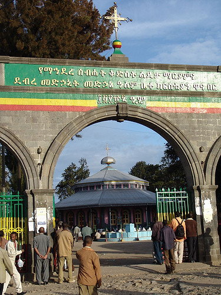
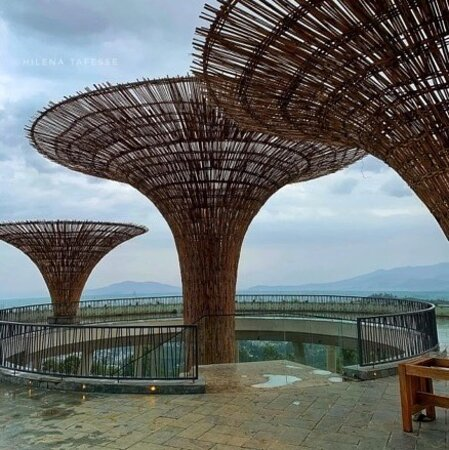

This project is involved in the development of an Amharic text generation system to create targeted ads for their Telegram ad solution. This project involves fine-tuning a Large Language Model (LLM) on Amharic text data to ensure high-quality text embedding and generation. By incorporating a Retrieval-Augmented Generation (RAG) pipeline, it aims to improve the ads' creativity and relevance by considering campaign information and the channel's history. This will ultimately enhance the effectiveness of the advertising efforts in the Amharic-speaking market.

  
  
  
  
  
  
  
  

